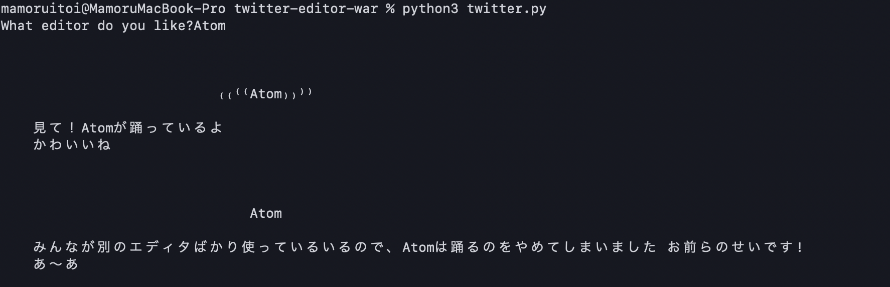

# 流行に乗ってみた
2020年2月17日に流行ったエディタが踊るという謎のツイートを、簡単に作れるプログラムです。
自分の好きなエディタを持ち上げ、自分の嫌いなエディタを貶すことでエディタ宗教戦争を活発化させる、ろくでもないレポジトリです。
ShellScriptとpythonに対応しています
## demo
python版
e.g. Atom

```console:
$ cd twitter-editor-war/
$ python3 twitter.py
What editor do you like?Atom #好きなエディタの名前（Atomだよな？）を入力せよ
```
ShellScript版
```console:
$ cd twitter-editor-war/
$ sh twitter.sh
What editor do you like?: Atom #好きなエディタの名前（Atomだよな？）を入力せよ
```


